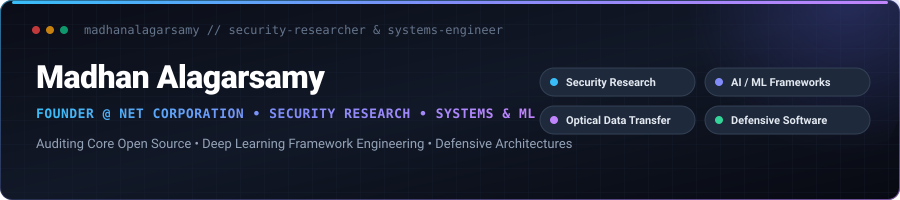

  

 

  <b>Security Researcher</b> &bull; <b>Systems & AI Frameworks Engineer</b> &bull; <b>Founder of <a href="https://netcorporation.site">Net Corporation</a></b>

  Specializing in upstream vulnerability discovery, defensive systems engineering, deep learning runtime optimizations, and air-gapped optical communication protocols.

---

[About Me](#about-me) &bull;
[Current Focus](#current-focus) &bull;
[Featured Projects](#featured-projects) &bull;
[Security Research](#security-research--upstream-auditing) &bull;
[Tech Stack](#tech-stack) &bull;
[GitHub Activity](#github-activity) &bull;
[Recent Work](#-recent-work) &bull;
[Connect](#connect-with-me)

---

## About Me

I am a Security Researcher, Systems & AI Engineer, and the Founder of **[Net Corporation](https://netcorporation.site)**. 

My work centers on identifying and mitigating critical software flaws in major open-source ecosystems, engineering high-assurance defensive software architectures, and optimizing deep learning frameworks. I direct Net Corporation's technology roadmap, secure code review desks, and project delivery pipelines.

Beyond applied security, I build resilient production systems—ranging from air-gapped screen-to-camera optical transfer channels using Luby Transform fountain codes to computer vision biometric verification and hardened web platforms.

---

## Current Focus

- 🛡️ **Vulnerability Research & Secure Code Review**: Auditing upstream machine learning and system libraries for arithmetic edge-case crashes, resource leaks, relative path traversals, and unverified CI/CD script executions.
- ⚡ **Deep Learning Framework Optimization**: Diagnosing runtime faults across distributed training (PyTorch DDP / Keras), quantization routines (GPTQ matrix division-by-zero resilience), and data loading pipelines.
- 📡 **Air-Gapped & Optical Data Transfer**: Advancing rateless Fountain Coding (Luby Transform) algorithms for high-throughput, screen-to-camera optical communication channels without network handshakes.
- 🔒 **Defensive Web Engineering**: Architecting hardened full-stack systems featuring multi-tier magic-byte file validation pipelines, atomic state-machine order workflows, and deterministic scheduling engines.

---

## Featured Projects

<table>
  <tr>
    <td width="50%" valign="top">
      <h3><a href="https://github.com/madhanalagarsamy/decimal-optical-transfer">📡 Decimal Optical Transfer</a></h3>
      
<b>Air-Gapped Screen-to-Camera Optical File Transmission</b>

      
Transmits up to <b>1 GB</b> of arbitrary files or text snippets between devices using purely a screen and a camera—zero Wi-Fi, zero Bluetooth, and zero pairing required.

      <ul>
        <li><b>Fountain Coding (Luby Transform)</b>: Solves visual packet loss by streaming endless pseudorandom block combinations (XOR). Receiving any ~K &times; 1.15 frames fully rebuilds the payload.</li>
        <li><b>Duo-QR Mosaic & Real-Time Decoding</b>: 2x optical throughput optimization with CRC32 integrity verification and live browser stream reconstruction.</li>
      </ul>
      

        <code>TypeScript</code> &bull; <code>Canvas API</code> &bull; <code>Fountain Codes</code> &bull; <code>Web Streams</code>
      

    </td>
    <td width="50%" valign="top">
      <h3><a href="https://github.com/madhanalagarsamy/national-people-database-face-recognition-system">👁️ Biometric Face Recognition System</a></h3>
      
<b>Biometric Citizen Record & Facial Verification Suite</b>

      
Comprehensive desktop biometric identity management application integrating real-time camera feeds, face detection bounding boxes, and dual-engine facial verification.

      <ul>
        <li><b>Embedded Video Acquisition</b>: Real-time OpenCV video stream embedded directly in Tkinter UI with capture, preview, and confidence scoring.</li>
        <li><b>Transactional Database Engine</b>: Multi-criteria citizen search, profile registry, and structured SQLite3 data persistence.</li>
      </ul>
      

        <code>Python</code> &bull; <code>OpenCV</code> &bull; <code>SQLite3</code> &bull; <code>Tkinter</code>
      

    </td>
  </tr>
  <tr>
    <td colspan="2" valign="top">
      <h3><a href="https://github.com/madhanalagarsamy/creative-corner-ecommerce">🛍️ Creative Corner — Production E-Commerce Platform</a></h3>
      
<b>Hardened Modular E-Commerce Backend & Scheduling Platform</b>

      
Production-grade e-commerce application engineered for bespoke handcrafted goods, custom artisan quotes, and deterministic fulfillment operations.

      <ul>
        <li><b>4-Tier Magic Byte Validation</b>: Rigid customer file upload security verifying file signatures and MIME types against forged headers.</li>
        <li><b>Dynamic Lead Time & Quote Engine</b>: Multi-item preparation scheduling algorithm combined with atomic quote-to-order state machine transitions.</li>
      </ul>
      

        <code>FastAPI</code> &bull; <code>SQLAlchemy 2.0</code> &bull; <code>Alembic</code> &bull; <code>Python 3.12+</code> &bull; <code>Jinja2</code>
      

    </td>
  </tr>
</table>

---

## Security Research & Upstream Auditing

I actively audit and contribute patches to top-tier machine learning frameworks and distributed systems:

| Target & Ecosystem | Contribution / Security Audit | Impact & Link | Status |
| :--- | :--- | :--- | :---: |
| **PyTorch** (`pytorch/pytorch`) | **CI Security Review**: Unverified `curl \| sudo bash` pipe execution in `install_docs_reqs.sh` | Identified remote execution risk in docs build script &bull; [Issue #191843](https://github.com/pytorch/pytorch/issues/191843) | `Open` |
| **PyTorch** (`pytorch/pytorch`) | **Core Pooling Parameter Fix**: Fix `nn.LPPool1d` and `F.lp_pool1d` rejecting tuple/list `kernel_size` | Restored parameter compatibility with standard PyTorch pooling conventions &bull; [PR #191868](https://github.com/pytorch/pytorch/pull/191868) | `Open` |
| **PyTorch** (`pytorch/pytorch`) | **Profiler & ONNX Code Audits**: Syntax errors in profiler examples & ONNX non-tensor export | Fixed syntax and code execution examples &bull; [#190202](https://github.com/pytorch/pytorch/issues/190202), [#190203](https://github.com/pytorch/pytorch/issues/190203), [#190204](https://github.com/pytorch/pytorch/issues/190204), [#190199](https://github.com/pytorch/pytorch/issues/190199) | `Resolved` |
| **Keras** (`keras-team/keras`) | **Quantization Arithmetic Fix**: Division by zero in `gptq_quantize_matrix` | Fixed zero-denominator floating point arithmetic exception during matrix quantization &bull; [PR #23415](https://github.com/keras-team/keras/pull/23415) / [Issue #23413](https://github.com/keras-team/keras/issues/23413) | `Open` |
| **Keras** (`keras-team/keras`) | **Distributed Training Fix**: PyTorch DDP execution crashes, NCHW shape errors & sampler state | Resolved multi-GPU DDP training crashes and shape propagation &bull; [PR #23454](https://github.com/keras-team/keras/pull/23454) | `Open` |
| **Keras** (`keras-team/keras`) | **OpenVINO Backend Fix**: OpenVINO eigh Jacobi rotation convergence and test skip matching | Stabilized eigenvalue computation in OpenVINO backend &bull; [PR #23446](https://github.com/keras-team/keras/pull/23446) | `Merged` |
| **Keras** (`keras-team/keras`) | **Resource Leak Audit**: `CSVLogger` file descriptor leak on training failure/interrupt | Identified unclosed file handles on aborted execution &bull; [Issue #23354](https://github.com/keras-team/keras/issues/23354) | `Resolved` |
| **Keras** (`keras-team/keras`) | **Security & Path Traversal Review**: `ModelCheckpoint` relative traversal path validation | Evaluated arbitrary file write vectors in checkpoint paths &bull; [Issue #23312](https://github.com/keras-team/keras/issues/23312) | `Resolved` |
| **Keras** (`keras-team/keras`) | **Image Decompression Bomb Audit**: `load_img()` PIL `DecompressionBombError` handling | Audited denial-of-service vectors on maliciously oversized image uploads &bull; [Issue #23317](https://github.com/keras-team/keras/issues/23317) | `Open` |
| **Keras** (`keras-team/keras`) | **Execution Integrity**: Fail fast on invalid callbacks in `CallbackList` | Prevented silent training corruption and delayed `AttributeError` &bull; [PR #23368](https://github.com/keras-team/keras/pull/23368) / [Issue #23263](https://github.com/keras-team/keras/issues/23263) | `Merged` |
| **TensorFlow** (`tensorflow/tensorflow`) | **Keras Model Conversion**: Multi-decorator `tf.function` conversion fix | Resolved conversion failures when multiple decorators are present &bull; [PR #124545](https://github.com/tensorflow/tensorflow/pull/124545) | `Closed` |
| **TensorFlow** (`tensorflow/tensorflow`) | **Memory Safety**: Host memory (RSS) leak in `tf.data.Dataset.from_generator` | Documented host memory exhaustion during GPU pipeline iterations &bull; [Issue #123269](https://github.com/tensorflow/tensorflow/issues/123269) | `Resolved` |
| **BigBlueButton** (`bigbluebutton/bigbluebutton`) | **Concurrency Audit**: Race condition in `User.addStream()` duplicate stream IDs | Identified stream identifier collision under high-concurrency access &bull; [Issue #25544](https://github.com/bigbluebutton/bigbluebutton/issues/25544) | `Open` |
| **Future-AGI** (`future-agi/future-agi`) | **Security Disclosure & Reliability**: Private Vulnerability Reporting & OTLP Queue Bounding | Recommended GHSA adoption & bounded pending ingestion queue &bull; [Issue #2195](https://github.com/future-agi/future-agi/issues/2195) / [PR #2203](https://github.com/future-agi/future-agi/pull/2203) | `Open` |

---

## Tech Stack

### Languages & Core

### AI, ML & Computer Vision

### Security & Systems Engineering

-blueviolet?style=flat-square)

### Backend, Web & Databases

---

## GitHub Activity

  
  
  
  

<!-- START_DYNAMIC_STATS -->

  <table>
    <tr>
      <td align="center" width="16%"><b>Issues Opened</b> <code>18</code></td>
      <td align="center" width="16%"><b>Currently Open</b> <code>11</code></td>
      <td align="center" width="16%"><b>Closed Issues</b> <code>7</code></td>
      <td align="center" width="16%"><b>PRs Opened</b> <code>12</code></td>
      <td align="center" width="16%"><b>Public Repos</b> <code>9</code></td>
      <td align="center" width="16%"><b>Followers</b> <code>2</code></td>
    </tr>
  </table>
  
Live metrics synced with GitHub API &bull; Last updated: 2026-08-28 17:58 UTC

<!-- END_DYNAMIC_STATS -->

 

  

---

## 🔥 Recent Work

<!-- START_DYNAMIC_PROJECTS -->
| Repository | Description | Primary Tech | Stars | Last Synced |
| :--- | :--- | :---: | :---: | :---: |
| [**`creative-corner-ecommerce`**](https://github.com/madhanalagarsamy/creative-corner-ecommerce) | Production-grade e-commerce backend and SSR platform featuring a 4-tier magic-byte customer file validation pipeline, dynamic lead-time engine, and custom quote builder. | `Python` | ⭐ 0 | 2026-08-26 |
| [**`vllm`**](https://github.com/madhanalagarsamy/vllm) *(upstream fork)* | A high-throughput and memory-efficient inference and serving engine for LLMs | `Python / C++` | ⭐ 1 | 2026-08-19 |
| [**`future-agi`**](https://github.com/madhanalagarsamy/future-agi) *(upstream fork)* | Open-source, end-to-end platform for evaluating, observing, and improving LLM and AI agent applications. Tracing · Evals · Simulations · Datasets · Gateway · Guardrails. Self-hostable. Apache 2.0. | `Python / C++` | ⭐ 0 | 2026-08-18 |
| [**`national-people-database-face-recognition-system`**](https://github.com/madhanalagarsamy/national-people-database-face-recognition-system) | Biometric citizen record management system featuring real-time camera capture, bounding box detection, and dual-engine facial verification. | `Python` | ⭐ 0 | 2026-08-18 |
<!-- END_DYNAMIC_PROJECTS -->

---

## Open Source Contributions

I actively contribute security audits, bug fixes, and feature implementations across key open-source technologies:

<table align="center">
  <tr>
    <td align="center"></td>
    <td align="center"></td>
    <td align="center"></td>
    <td align="center"></td>
  </tr>
  <tr>
    <td align="center"></td>
    <td align="center"></td>
    <td align="center"></td>
    <td align="center"></td>
  </tr>
</table>

---

## Connect With Me

  Reach out via <b><a href="https://netcorporation.site">netcorporation.site</a></b> for security audits, technical research inquiries, or collaborative engineering initiatives.

---

<!--ISSUE_STATS_START-->
<table align="center">
  <tr>
    <td align="center"><b>Total Issues Opened</b> 18</td>
    <td align="center"><b>Currently Open</b> 11</td>
    <td align="center"><b>Closed</b> 7</td>
    <td align="center"><b>PRs Opened</b> 12</td>
  </tr>
</table>

Last updated: 2026-08-28 17:58 UTC

<!--ISSUE_STATS_END-->
